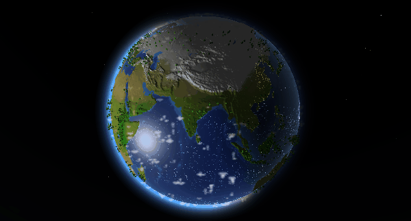

# Building Earth

A first-principles climate simulation with composable components that breaks down why climate works the way it does. Comes with an LLM explainer and a 3D frontend visualization.

Live at **[earth.crackalamoo.com](https://earth.crackalamoo.com)**



---

Building Earth is an interactive 3D globe that runs a real climate simulation that derives temperature, humidity, precipitation, wind, and clouds from first principles. Click anywhere on the planet and ask why.

The simulation solves for a full annual cycle across a global grid, driven by:

- **Solar radiation** — seasonal insolation, zenith angle, day length
- **Atmospheric energy balance** — radiation, sensible and latent heat exchange, optical depth
- **Humidity & precipitation** — advection, diffusion, evaporation, clouds
- **Wind** — thermal pressure gradients, geostrophic balance, orographic effects, ocean currents
- **Surface effects** — albedo, snow cover, vegetation, elevation

Results are evaluated against NOAA climatology, but the model itself is fully first-principles; there is no explicit dependence on historical climatology data.

## Tech stack

| Layer | Technology |
|-------|-----------|
| Simulation | Python · NumPy · SciPy (Newton solver) |
| Backend API | FastAPI · OpenAI (LLM chat) |
| Frontend | Svelte · Three.js |

## Running locally

The simulation, frontend, and LLM/data backend are independent — you don't need all three running to work on any one of them.

### Globe (physics + visualization)

No data downloads needed. The simulation is fully self-contained.

```bash
# 1. Run the simulation (~a few minutes at res 5)
make sim

# 2. Export output to frontend binary format
make export

# 3. Start the frontend dev server
make frontend
```

### LLM chat backend

The "ask why" chat feature is a separate FastAPI server. It requires an OpenAI API key and the NOAA reference data files (used for LLM tool context, not the simulation itself).

```bash
# Download obs reference data from R2 (one-time, ~30MB)
make download-obs

# Create .env with your OpenAI key
echo "OPENAI_API_KEY=sk-..." > .env

# Start the backend
make backend        # runs on port 8000
```

### Evaluate against NOAA climatology

```bash
make sim            # or reuse a cached run
uv run python backend/eval.py --cache --headless --resolution 5
```

