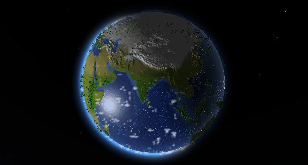

# Building Earth

A first-principles climate simulation with composable components that breaks down why climate works the way it does. Comes with an LLM explainer and a 3D frontend visualization.

Live at **[earth.crackalamoo.com](https://earth.crackalamoo.com)**



---

Building Earth is an interactive 3D globe that runs a real climate simulation that derives temperature, humidity, precipitation, wind, and clouds from first principles. Click anywhere on the planet and ask why the climate is like that there.

The simulation solves for a full annual cycle across a global grid, driven by:

- **Solar radiation** — seasonal insolation, zenith angle, day length
- **Atmospheric energy balance** — radiation, sensible and latent heat exchange, optical depth
- **Humidity & precipitation** — advection, diffusion, evaporation, clouds
- **Wind** — thermal pressure gradients, geostrophic balance, orographic effects, ocean currents
- **Surface effects** — albedo, snow cover, vegetation, elevation

Results are evaluated against NOAA climatology, but the model itself is fully first-principles; there is no explicit dependence on historical climatology data.

## Evaluation against NOAA

Annual, area-weighted comparison against 1981–2010 NOAA climatology at 5° resolution (land 2 m air temperature: GHCN-CAMS; SST: COBE2; precipitation: GPCP; humidity, SLP, wind, clouds: NCEP reanalysis). Bias is sim − obs.

| Variable | Global RMSE | Bias (land / ocean / global) | Pattern corr. (land / ocean / global) |
|----------|------------:|:----------------------------:|:-------------------------------------:|
| Temperature: land T2m, ocean SST (°C) | 4.10 | +1.43 / +0.61 / +0.84 | 0.94 / 0.94 / 0.94 |
| Specific humidity (g/kg) | 3.25 | +1.72 / +1.06 / +1.25 | 0.86 / 0.91 / 0.90 |
| Relative humidity (%) | 20.3 | −9.7 / +6.7 / +2.1 | 0.54 / −0.12 / 0.27 |
| Precipitation (mm/day) | 2.32 | −0.47 / −1.34 / −1.08 | 0.66 / 0.37 / 0.48 |
| Sea-level pressure (hPa) | 8.33 | −0.49 / +2.58 / +1.66 | 0.55 / 0.69 / 0.62 |
| 10 m wind speed (m/s) | 3.15 | −0.05 / −0.70 / −0.51 | −0.14 / 0.20 / 0.23 |
| Cloud cover (%) | 26.4 | −4.6 / +6.6 / +3.2 | 0.36 / −0.01 / 0.29 |

Temperature is the strongest result: pattern correlation with observations is 0.94, with land (T2m) RMSE of 5.5 °C and ocean (SST) RMSE of 3.4 °C. Wind direction is captured better than speed (U-component correlation 0.61, V-component 0.31). Precipitation is too low overall, especially over the ocean (sim 1.5 vs obs 2.9 mm/day).

## Tech stack

| Layer | Technology |
|-------|-----------|
| Simulation | Python · NumPy · SciPy (Newton solver) |
| Backend API | FastAPI · OpenAI (LLM chat) |
| Frontend | Svelte · Three.js |

## Running locally

The simulation, frontend, and LLM/data backend are independent — you don't need all three running to work on any one of them.

### Globe (physics + visualization)

No data downloads needed. The simulation is fully self-contained.

```bash
# 1. Run the simulation (~a few minutes at res 5)
make sim

# 2. Export output to frontend binary format
make export

# 3. Start the frontend dev server
make frontend
```

### LLM chat backend

The "ask why" chat feature is a separate FastAPI server. It requires an OpenAI API key and the NOAA reference data files (used for LLM tool context, not the simulation itself). The same backend is also used to display reference climate charts in the UI.

```bash
# Download obs reference data from R2 (one-time, ~30MB)
make download-obs

# Create .env with your OpenAI key
echo "OPENAI_API_KEY=sk-..." > .env

# Start the backend
make backend        # runs on port 8000
```

### Evaluate against NOAA climatology

```bash
make sim            # or reuse a cached run
make eval
```

